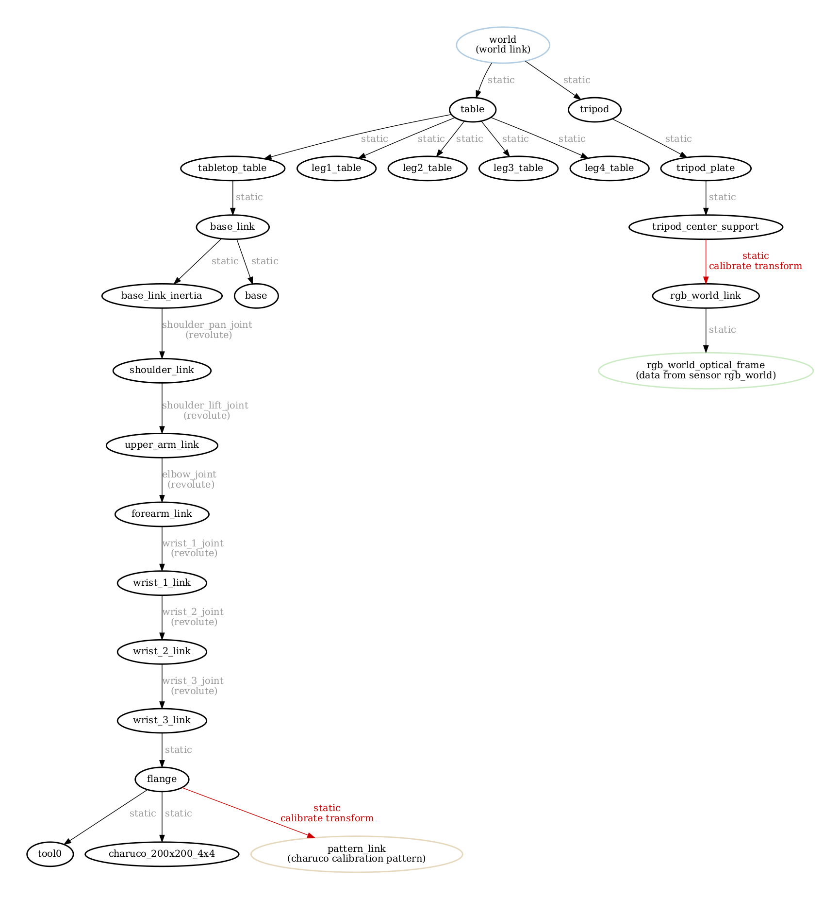

# RGB_EYE_IN_WORLD_SYSTEM

The **riwbot** is a robotic system used to evaluate hand eye calibrations in ATOM.

The system contains a single rgb camera mounted on a tripod, facing a robotic manipulator.
The camera is called **rgb_world** (green).
The system contains the following topics:

  - /rgb_world/camera_info
  - /rgb_world/image_raw
  - /tf
  - /tf_static
  - /joint_states

Since this is a systems to test calibration, where frame rate is not a critical issue, we restrained images topics to 10Hz.
This is a simulated system, which can be seen in gazebo:

... and in rviz:

# How to run

First launch the gazebo simulation:

    roslaunch riwbot_gazebo gazebo.launch

Then you can bringup the system:

    roslaunch riwbot_bringup bringup.launch

You can record a bag file using:

    roslaunch riwbot_bringup record.launch

This will put the bag file into your $ROS_BAGS folder.

# Calibration

As always, we recommend a careful reading of the [documentation](https://lardemua.github.io/atom_documentation/) to learn all the details.

In this section, out goal is to describe the calibration pipeline for the **riwbot**.

To calibrate, we will need a bagfile called [train.bag](https://drive.google.com/file/d/1_YYIaJfvP8G7_mBr3oT7S7RkVTymu2pb/view?usp=sharing), which contains a recording of the system's data when viewing a calibration pattern in several positions.
We produced the bagfile by bringing up the system and then recording a bagfile as described above.
This is a bagfile with 140 seconds / 115MB for demonstration purposes. Typically, calibration bagfiles are larger.

Download the bagfile and put it in **$ROS_BAGS/riwbot**.

Next we describe each of the steps in the calibration pipeline.

## Creating a calibration package

See also the [generic documentation](https://lardemua.github.io/atom_documentation/procedures/#create-a-calibration-package) on this topic.

Using ATOM conventions, we define name of the calibration package as **riwbot_calibration**, and create it using:

    rosrun atom_calibration create_calibration_pkg --name riwbot_calibration

**NOTE**: This procedure is carried out only once, and was done already. As such, this ros package is already [included in the atom repo](https://github.com/lardemua/atom/tree/noetic-devel/atom_examples/riwbot/riwbot_calibration). Therefore, you **should not execute this instruction** for the riwbot.

## Configuring the calibration

This is the [config.yml](https://github.com/lardemua/atom/blob/noetic-devel/atom_examples/riwbot/riwbot_calibration/calibration/config.yml) that we wrote to define the calibration. There is a single sensor to be calibrated, named **rgb_hand**. The pattern is a charuco marker.
The configuration file points to the train bagfile mentioned above, and the _anchored_sensor_ is not defined.

To configure run:

    rosrun riwbot_calibration configure

Which will run a series of checks and produce several files inside the **riwbot_calibration** package.

The configuration produces a [visual schematic summarizing](https://github.com/lardemua/atom/blob/noetic-devel/atom_examples/riwbot/riwbot_calibration/calibration/summary.pdf) the calibration you have setup.

It is advisable to inspect this document carefully to make sure that the calibration is well configured.

## Collecting a dataset

To collect a dataset we run:

    roslaunch riwbot_calibration collect_data.launch output_folder:=$ATOM_DATASETS/riwbot/dataset1 overwrite:=true

And save a few collections.

We will use as example the [train](https://drive.google.com/file/d/1YlFdik-38zhtI8fByY27XR7pxYdN-h_9/view?usp=sharing) dataset, which contains 11 collections. Some are shown below.

Download and decompress the dataset to **$ATOM_DATASETS/riwbot/train**.

Collection |           rgb_hand
:----------------:|:-------------------------:
0 | 
1 | 
2 | 
3 | 

## Running the Calibration

To calibrate, first setup visualization with:

    roslaunch riwbot_calibration calibrate.launch

This is useful to visualize the collections stored in the dataset.

Then carry out the actual calibration including noise, using:

    rosrun atom_calibration calibrate -json $ATOM_DATASETS/riwbot/train/dataset.json -v -rv -nig 0.1 0.1

This will produce a table of residuals per iteration, like this:

Which starts the calibration with these errors:

which are quite high, because of the incorrect pose of the sensors,  and ends up converging into these figures:

Which shows subpixel accuracy. This means the procedure achieved a successful calibration.

During calibration We can see all collections in the system and, as the calibration progresses, the estimated transformations will be applied to the visualization. The table below shows the positioning of the **rgb_hand** sensor before the calibration starts (using nig 0.1 0.1), and after the calibration is carried out.

View |           Before calibration             |           After calibration
:----------------:|:-------------------------:|:-------------------------:
All collections |  |  
Collection 0 |  |  
Collection 0 (top view)|  |  

## Evaluation

test bag file
https://drive.google.com/file/d/1iKMODjk2m37TBB3tWavJfZlKlwx-WHWz/view?usp=sharing

The evaluation be conducted with a second dataset which has not been seen during calibration. We call these the test datasets.

Download the [test](https://drive.google.com/file/d/16Vi6xo6kt2wEeFBWbTGrZdOL8DmT5ztt/view?usp=sharing) and decompress to **$ATOM_DATASETS/riwbot/test**.

    roslaunch riwbot_calibration full_evaluation.launch test_json:=$ATOM_DATASETS/riwbot/test/dataset.json train_json:=$ATOM_DATASETS/riwbot/train/atom_calibration.json

Since we have a single sensor, we do not have reprojection errors. The error w.r.t. the ground truth is:

which shows sub-millimeter accuracy.