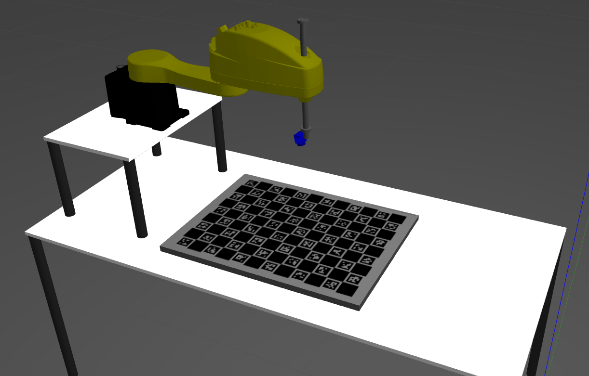
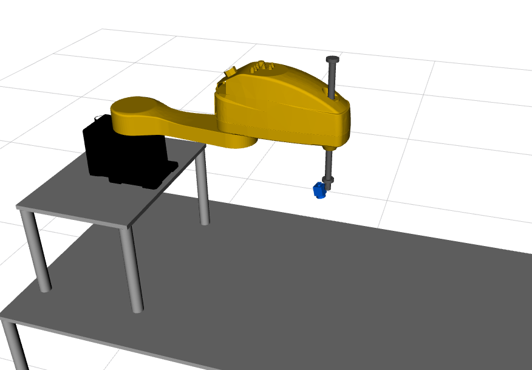
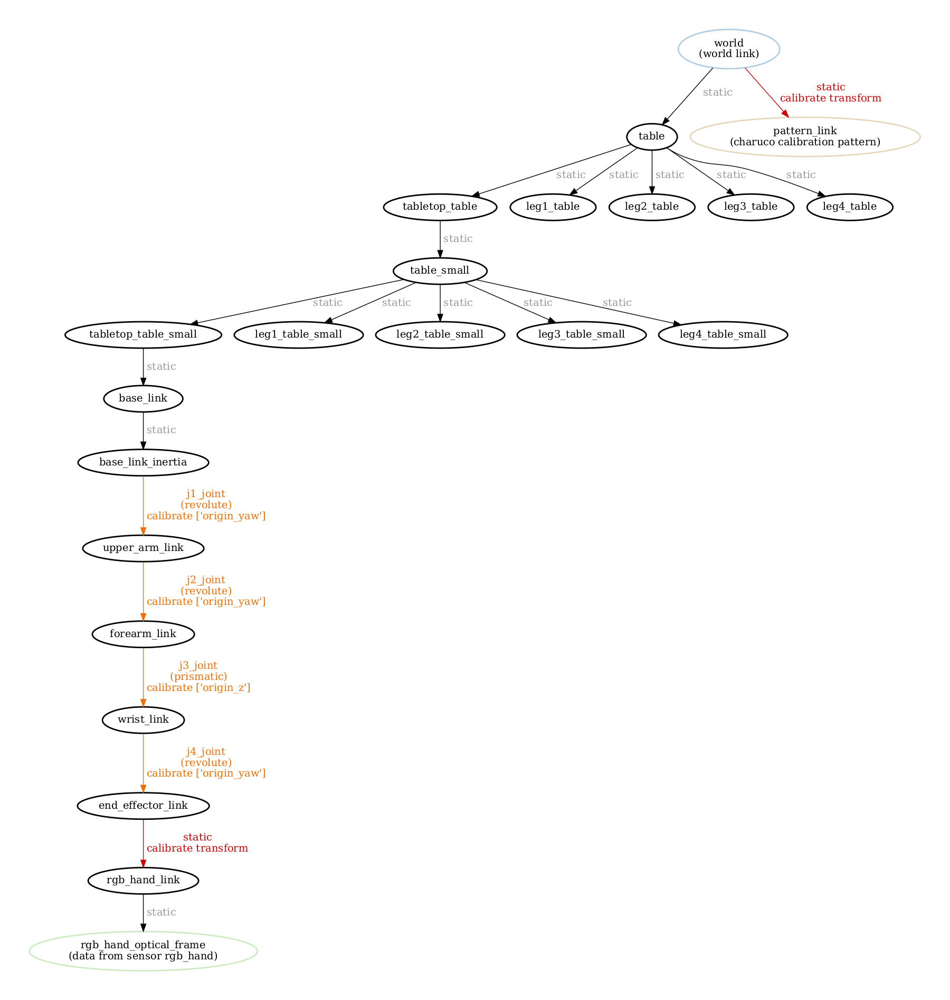
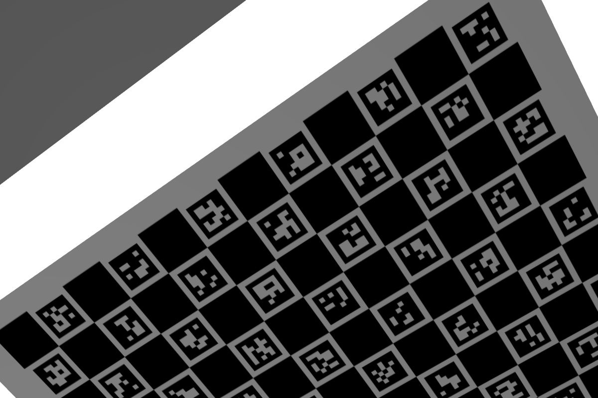
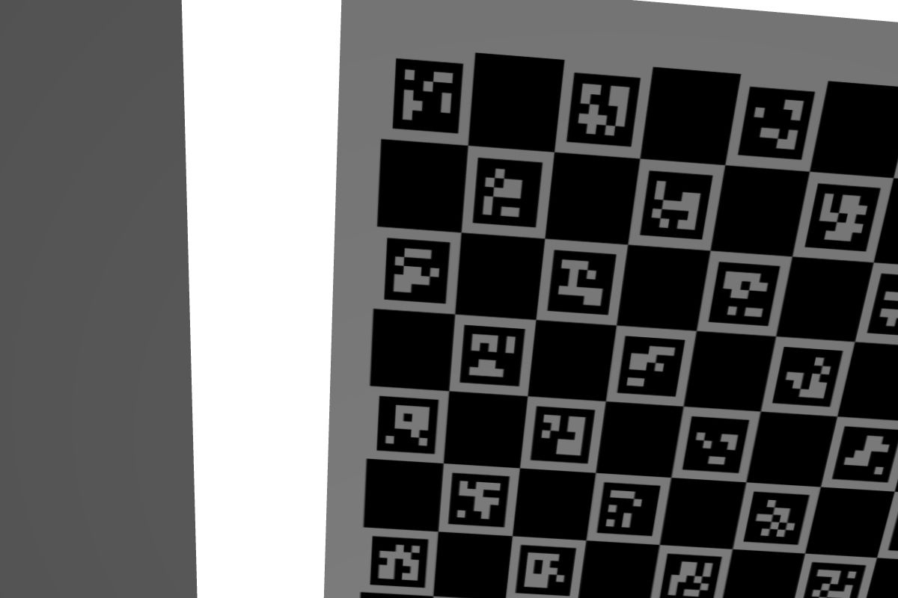
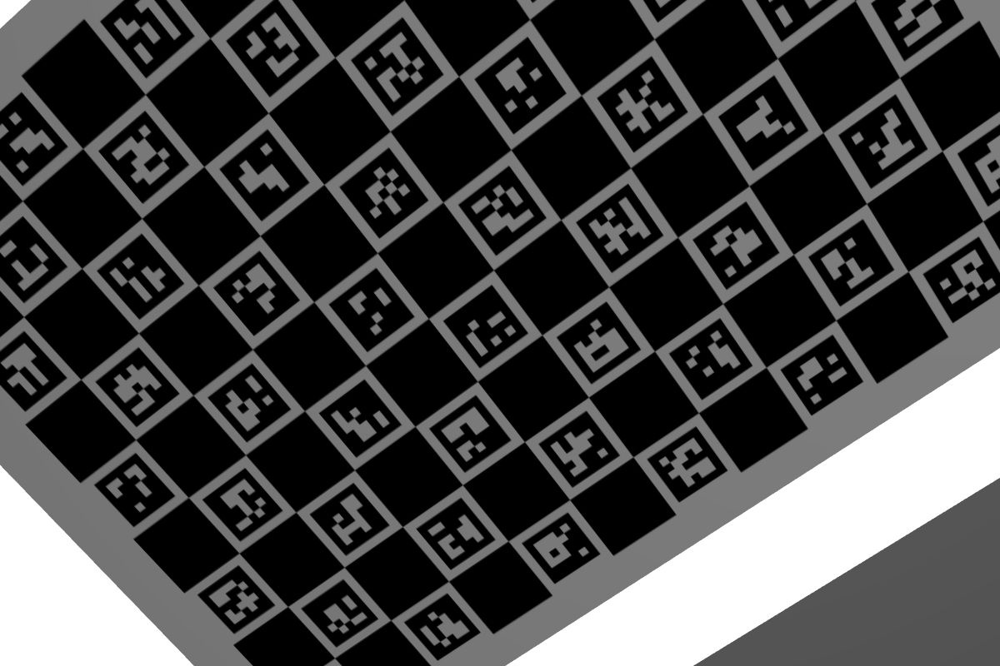
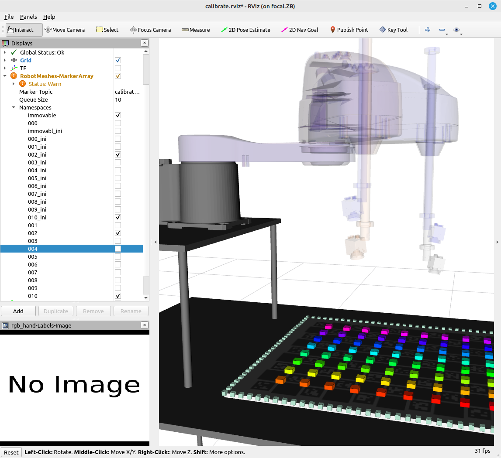
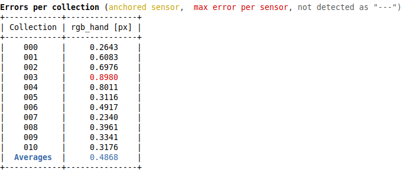
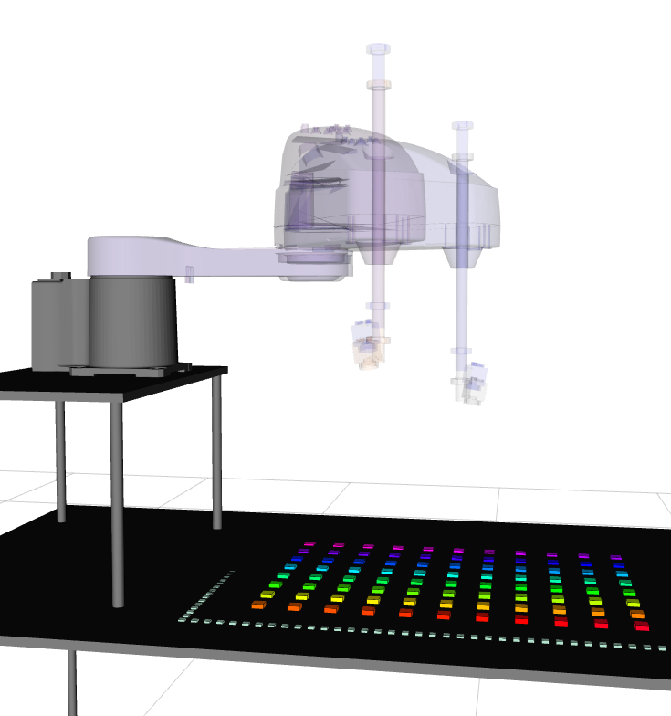
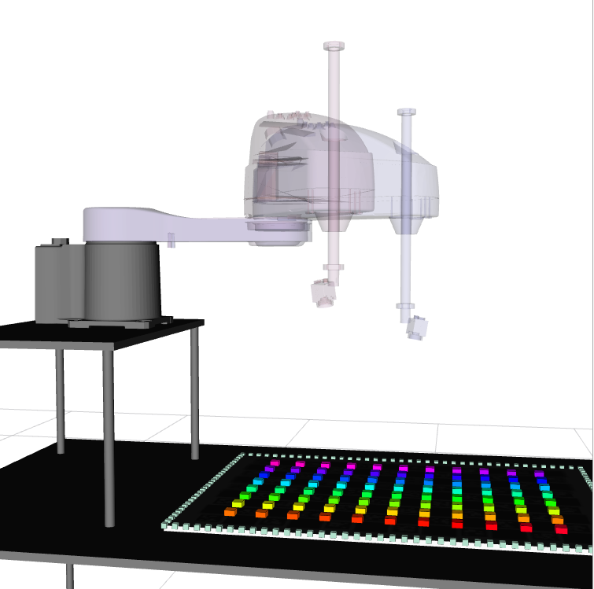

# SPJBOT

The **s**cara with **p**rismatic **j**oints ro**bot** (**spjbot**) is a simulated robotic system used to exemplify prismatic joint calibrations in ATOM.

The goal of this system is to show how ATOM may be configured to calibrate prismatic joints in a robotic system.

The configuration of the system is exactly the same as the [rihbot](https://github.com/lardemua/atom/tree/noetic-devel/atom_examples/rihbot), including the elements in the scene, the positioning of sensors, and the ros topics, which is why we will not specify these here.

The system can be seen in rviz in the following picture:

# How to run

First launch the gazebo simulation:

    roslaunch spjbot_gazebo gazebo.launch

Then you can bringup the system:

    roslaunch spjbot_bringup bringup.launch

You can record a bag file using:

    roslaunch spjbot_bringup record.launch

This will put the bag file into your \$ROS_BAGS folder. You should move it to the **$ROS_BAGS/jcpb** folder.

# Calibration

As always, we recommend a careful reading of the [documentation](https://lardemua.github.io/atom_documentation/) to learn all the details.

In this section, out goal is to describe the calibration pipeline for the **spjbot**.

To calibrate, we will need a bagfile called [train.bag](https://drive.google.com/file/d/1M3FyPB9ZTMqF9WioXKbiHa9tIDl9zpYP/view?usp=sharing), which contains a recording of the system's data when viewing a calibration pattern in several positions.

Download the bagfile and put it in **$ROS_BAGS/spjbot/train.bag**.

## Creating a calibration package

Using ATOM conventions, we define name of the calibration package as **spjbot_calibration**, and create it using:

    rosrun atom_calibration create_calibration_pkg --name spjbot_calibration

**NOTE**: This procedure is carried out only once, and was done already. As such, this ros package is already [included in the atom repo](https://github.com/lardemua/atom/tree/noetic-devel/atom_examples/spjbot/spjbot_calibration). Therefore, you **should not execute this instruction** for the spjbot.

## Configuring the calibration

This is the [config.yml](https://github.com/lardemua/atom/blob/noetic-devel/atom_examples/spjbot/spjbot_calibration/calibration/config.yml) that we wrote to define the calibration. There is a single sensor to be calibrated, named **rgb_hand**. The pattern is a charuco marker. Notice that we are using the **train_with_noise.bag** bagfile.

To configure run:

    rosrun spjbot_calibration configure

Which will run a series of checks and produce several files inside the **spjbot_calibration** package.

The configuration produces a [visual schematic summarizing](https://github.com/lardemua/atom/blob/noetic-devel/atom_examples/spjbot/spjbot_calibration/calibration/summary.pdf) the calibration you have setup.

As we can see the calibration configuration will estimate the parameters of a complete static transformation, from **end_effector_link** to **rgb_hand_link**. These are the parameters that will position the rgb_hand sensor w.r.t. the end effector of the robotic manipulator. This component is a classical eye-in-hand calibration, as discussed in the [rihbot](https://github.com/lardemua/atom/tree/noetic-devel/atom_examples/rihbot) example.

The additional complexity comes from the calibration of the **origin_yaw** parameters of all of the manipulator's revolute joints, although this is covered in other atom examples. The difference here is that we are also calibrating a prismatic joint, i.e., the **j3_joint**. To accomplish this we set the joint parameter to be optimized to **origin_z**, as this is a prismatic joint that slides along the z axis.

## Collecting a dataset

To collect a dataset we run:

    roslaunch spjbot_calibration collect_data.launch output_folder:=$ATOM_DATASETS/spjbot/dataset1 overwrite:=true

And save a few collections.

We will use as example the [train](https://drive.google.com/file/d/1WjbzB9MRPmGcowggLKX-zDOaKnj89yRF/view?usp=sharing) dataset, which was created using the train_with_noise bagfile and thus contains joint position errors. The dataset contains 11 collections. Some are shown below.

Download and decompress the dataset to **$ATOM_DATASETS/spjbot/train**.

Collection |           rgb_hand
:----------------:|:-------------------------:
0 | 
1 | 
7 | 
8 | 

## Running the Calibration

To calibrate, first setup visualization with:

    roslaunch spjbot_calibration calibrate.launch

This is useful to visualize the collections stored in the dataset. Here you can see a visual representation of all collections and the corresponding camera at the start of the optimization. We will set the namespaces in the RobotMeshes-MarkerArray display marker, so that **we see only collections 002 and 010**. Since we are using a simulated system, we know the initial positions of the sensors and the robot actually represent the ground truth for the calibration. Using the **--initial_pose_ghost (-ipg)** argument we can also represent these starting, ground truth poses in rviz. In the namespaces **mark the 002_ini and 010_ini** to view the starting poses of collections 002 and 010.

To carry out the actual calibration we should add some noise to the starting point of the optimization. To do this we will add some bias to the joints using the arguments **--joint_bias_names (-jbn)** and **--joint_bias_values (-jbv)**:
Let's add 0.01 radians (0.57 degrees) to joints j1 and j2, and 0.08 meters to prismatic joint j3.

    rosrun atom_calibration calibrate -json $ATOM_DATASETS/spjbot/train/dataset.json \
    -v -rv  -pp -ipg -phased \
    -jbn j1_joint j2_joint j3_joint -jbv 0.01 0.01 0.08

The calibration will carry out and produce very low reprojection errors. The final table should be like this:

However, from rviz we can clearly observe that the estimated poses are not coincident with the ground truth (represented in blue).

Also, since we are using the **--print_parameters (-pp)** option, at the end of the optimization we can see that the estimated parameter values are:

Joint name | Inserted bias (rad) | Estimated bias (rad) |
:---:|:---:|:---:|
j1_joint | 0.01 | -0.0075
j2_joint | 0.01 | -0.0098
j3_joint | 0.08 (m) | 0.0267 (m)
j4_joint | 0.0 | 0.0024

which again confirms that the calibration did not go well.

The reason for this is that there is a large redundancy along the vertical direction between the **origin_z** parameter, but also vertical component of the transformation that describes the pose of the camera, and in addition to this the vertical component of the transformation that describes the pose of the pattern. All these are being simultaneously estimated, and there is no way for ATOM to distinguish between them. The error will go down either by moving the camera upwards, or instead moving the origin_z of the end-effector upwards (which also brings the camera upwards), or as a third option by moving the pattern down.

The trivial solution for this problem is to lock the poses of both the camera and the pattern. This can be achieved using the commands **--anchor_patterns (-ap)** and **--anchor_sensors (-as)**, as follows:

    rosrun atom_calibration calibrate -json $ATOM_DATASETS/spjbot/train/dataset.json \
    -v -rv  -pp -ipg -phased \
    -jbn j1_joint j2_joint j3_joint -jbv 0.01 0.01 0.08 \
    -ap -as rgb_hand

which results in a perfect alignment between estimate and ground truth:

In terms of the calibrated values, we get:

Joint name | Inserted bias (rad) | Estimated bias (rad) |
:---:|:---:|:---:|
j1_joint | 0.01 | -0.01029
j2_joint | 0.01 | -0.0091
j3_joint | 0.08 (m) | 0.0802 (m)
j4_joint | 0.0 | 0.0001

which shows that ATOM was able provide very accurate estimates to compensate the introduced biases.

This solution is a trivial one, which may not be practical for real applications. For example, it may not be plausible to say that the pose of the camera is known and does not have to be optimized. ATOM supports solutions to address these challenges, to be described in other examples.